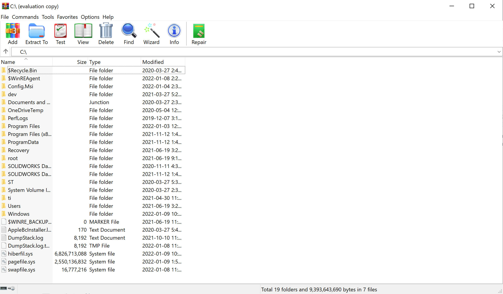
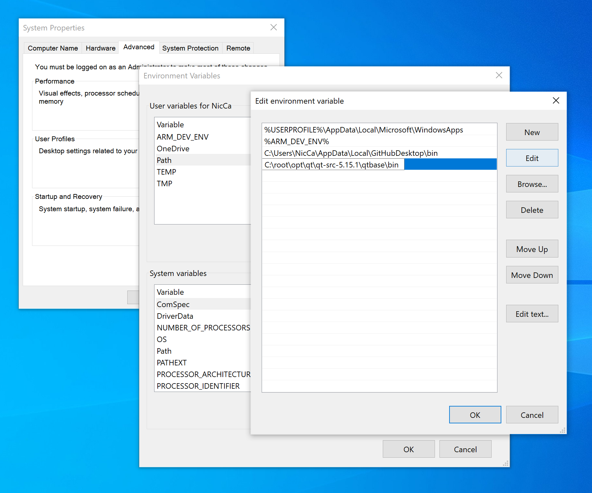
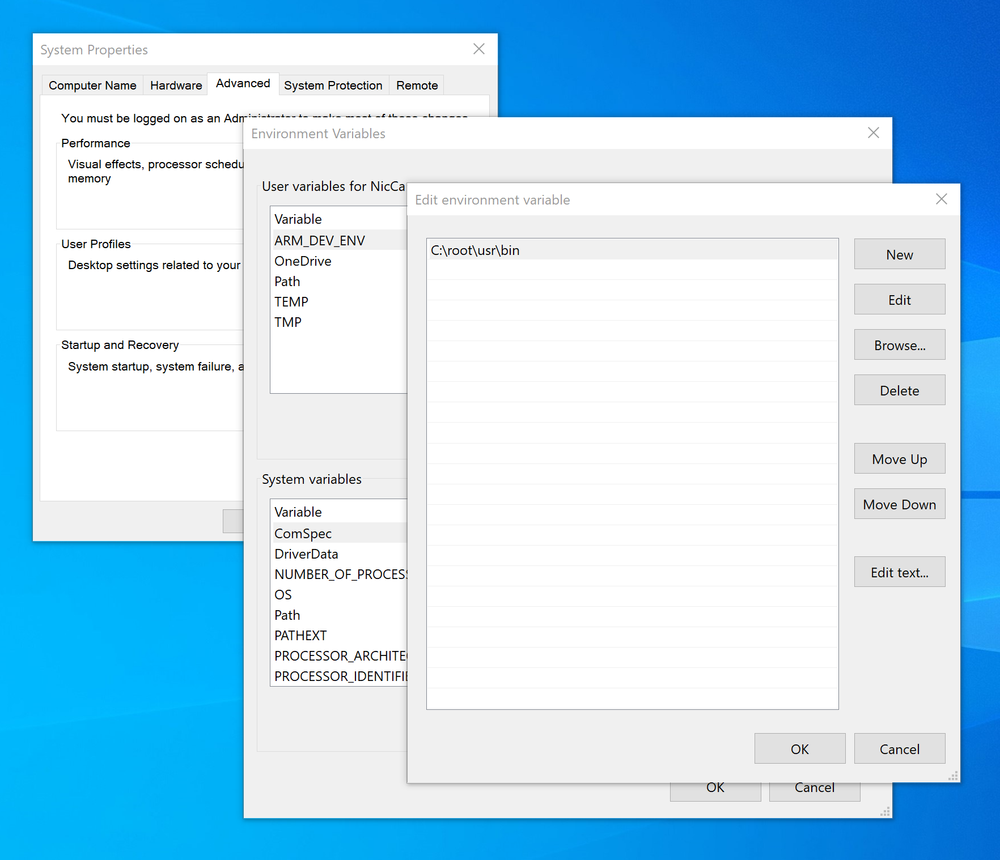
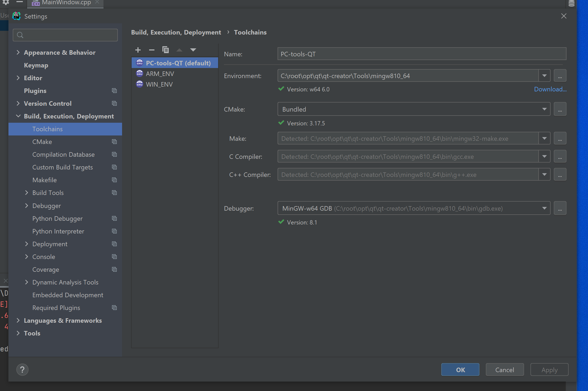
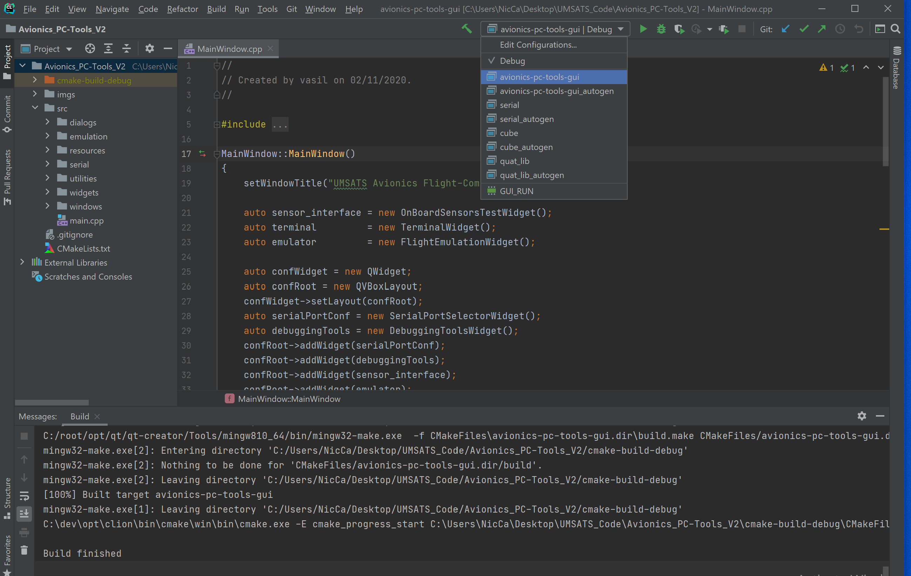
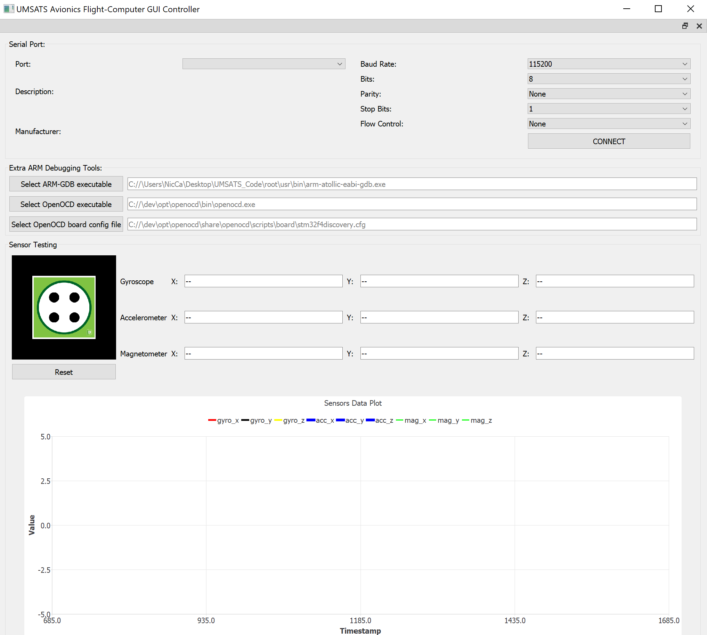

In this README you will come to understand the basics of toolchain systems (including compilers, linkers and makefiles), building processes, difference in platforms.
You will also learn how to setup Windows Environment similar to Linux and compile Avionics-PC-Tools project with CLion. I will also explain why it is better to be able to set 
up CLion for development.

# How To Run PC-Tools Software
*Requires Windows OS*

### Download WinRAR (needed for env setup)

1. Go to -> https://www.win-rar.com/ then download and install WinRAR for Windows OS in order to extract QT.rar (zipped) file.
2. Ensure WinRAR was installed properly by opening the application through file system or type **WinRAR** into the taskbars search field.
3. The application looks as follows:

### Obtain Software Latest Version

1. Go to -> https://git-scm.com/downloads and download Git for Windows OS.
2. Open a Command Prompt and type `git` to ensure a successfull download.
3. Navigate to the location which you wish to store the GUI software. (ex. `cd C:\Users\userx\Desktop\UMSATS_Code\`)
4. Copy the repository link and clone the repository with `git clone https://github.com/UMSATS/repository_name.git`.
5. Wait for the download to complete and we have succefully obtained the latest GUI software version.

### Setup The Development Environment
*We need CLion(IDE), toolchains/MinGW/CMake*

1. In the directory `C:\` create a new folder called `dev` and inside that create a folder called `opt` so you should have the directory `C:\dev\opt`.
2. Install CLion into `C:\dev\opt\clion` and you should have no trouble setting up a free student version or free trial.
3. Locate the `qt` folder on the drive `Shared drives -> ROCKETS -> Current Design Cycle -> AVIONICS -> Flight Computer -> Files`.
5. In the directory `C:\` create a new folder called `root` and inside that create a folder called `opt` so you should have the directory `C:\root\opt`.
6. Download, then extract with WinRAR and move the extracted `qt.rar` folder to `C:\root\opt` so you should have `C:\root\opt\qt`.
7. Now that we have everything we need in place, we need environemnt variables so the executables can be seen system wide. In the Windows taskbar search for 
**environement variables** and select **Edit the system environment variables**, and click **Environment Variables**.
8. In the variable box under **User variables for userx** select the **Path** variable are click **Edit**. Click **New** and put **C:\root\opt\qt\qt-src-5.15.1\qtbase\bin** 
so you now see the following:

9. Click **Ok** then **Ok** and finally, **Ok**.
10. Now we will follow similar steps as executed above to setup CMake.
11. Locate the `root` folder on the drive `Shared drives -> ROCKETS -> Current Design Cycle -> AVIONICS -> Flight Computer -> Files`.
12. Download, extract and move the `root` folder to `C:\` so you should have `C:\root\usr\bin`.
13. Now that we have everything we need in place, we need environemnt variables so the executables can be seen system wide. In the Windows taskbar search for 
**environement variables** and select **Edit the system environment variables**, and click **Environment Variables**.
14. In the variable box under **User variables for userx** click **new** and for **Variable name:** put **ARM_DEV_ENV** and for **Variable value:** put 
**C:\root\usr\bin** and click **Ok**.
15. If you click on the variable you just created you should see the following: 

10. Now we must include this variable we created into the **Path** system environement variable. In the varaible box under **System variables** find the 
**Path** variable and select **Edit...**.
11. Select **New** and enter **%ARM_DEV_ENV%** to add our previously created variable to the path variable.
12. Click **Ok** then **Ok** and finally, **Ok**.

### Ensure Environment Is Configured Properly

1. Run Command Prompt as administrator and type the following:
	1. Type 'cmake'

NOTE: Make sure that the following commands work, if it says:
CMD: 'your command' is not recognized as an internal or external command, operable program or batch file.
PowerShell: The term 'your command' is not recognized as the name of a cmdlet, function, script file, or operable program
Then open another terminal session and do it again, try both terminals CMD and PowerShell, if the problem persists then go
back to Environment Variables and make sure you set up everything like I described and then try again.

2. Run CLion as administrator or call `C:\dev\opt\clion\bin\clion64.exe` through an administrator command prompt.
3. Ensure any other projects that may be open in CLion are closed and open the GUI software that should be located in a folder similar to 
`C:\Users\userx\Desktop\UMSATS_Code\Avionics_PC-Tools_V2`.
4. Select the CLion terminal and type the following to ensure CLion can see the evironment we setup:
	1. Type 'cmake'

### Configure CLion Settings For GUI Target Device

1. Go to File -> Settings -> Build, Execution, Deployment -> Toolchains.
2. Click the plus `+` icon and select **MinGW** to setup a MinGW toolchain.
3. Set the fields as follows:
	- Name: PC-tools-QT
	- Environment: C:\root\opt\qt\qt-creator\Tools\mingw810_64
	- CMake: Bundled
	- Make: C:\root\opt\qt\qt-creator\Tools\mingw810_64\bin\mingw32-make.exe
	- C Compiler: C:\root\opt\qt\qt-creator\Tools\mingw810_64\bin\gcc.exe
	- C++ Compiler: C:\root\opt\qt\qt-creator\Tools\mingw810_64\bin\g++.exe
	- Debugger: C:\root\opt\qt\qt-creator\Tools\mingw810_64\bin\gdb.exe

NOTE: The above folders/files can be manually selected through browsing your file system using the **...** icon next to the dropdown arrow of each field.

4. Ensure you see the following (ignoring WIN_ENV and ARM_ENV), then click **Ok**:

5. Force the system to build by right clicking on the project and selecting **Reload CMake Project**.
6. We should now be able to go to Build -> Build Project and generate `avionics-pc-tools-gui.elf` for our debugger.

### Setup Debugger in CLion

1. In the CLion toolbar at the top, click the drop down menu between the build hammer and run play button.
2. Select the `avionics-pc-tools-gui.elf` file we just generated by selecting the highlighted option shown below:

### Upload, Run and Debug GUI Software

1. Go to Run -> Run ''avionics-pc-tools-gui'' or press the run play button and the software will launch and appear similar to:

CLion:
-----------------

This is also IDE! But it is not eclipse based, thus, you must set it up yourself. Plus, CLion does not have an internal building project tools and purely relies on CMake Project generating
tool. Benefits are that you will completely understand how project is build an compiled, will have control over the smallest details and CLion is way cooler IDE which is extremely
intelligent compared to dump and stupid eclipse which does not provide any comfort neither for editing nor for debugging. Lastly, the design of eclipse sucks!

Some theory to know before proceeding with CLion.
Before setting things up, if you happened to work on Windows OS, then I just want to let you know that setting up environment
takes more steps than for Linux OS. First thing you need to understand is that Windows works very tight with environment variables,
while Linux uses symbolic links and installation principles. Symbolic links are similar to Windows shortcuts, but the difference
is that the former can act as executable, while Windows shortcuts (also well known as lnk files) cannot be executed.
Also, in Linux, many software libraries especially those that are meant to be used in command line install the corresponding executables
into /usr/bin folder, so you end up having every single tool in one location. Therefore, if some application does not have a dedicated bin
folder that is copied into /usr/bin/ then you can create a symbolic link to its executable and put it into /usr/bin - the effect is identical.
Linux's /usr/bin folder is identical to how Windows Environment Path works. You can treat them the same way.
If you want to have a way to run your application from Linux terminal calling it by its name only, you need to make sure that
you have an executable or symbolic link symbolic link in /usr/bin/.
On Windows if you want to run your application from CMD or any terminal calling it by its name only, you need to make sure that
you have its path (where .exe file is, usually in the root directory of particular application or in some of its nested folders) set in the Environment Path.

Windows Environment Paths:
-----------------

On Windows you have two Environment Paths: System Environment Path and User Environment Path. Both are called as "Path"
So you have two versions of this variable, one is seen system-wide, one is seen user-wide.
You can check your Environment Variables by going to: Control Panel ->System and Security -> Environment -> Advanced System Settings -> Environment Variables
You will see two tables, one is dedicated for USER and one is for SYSTEM. If you want to setup command line only for yourself then use the table above, if you want them to work
for all users, use the one below.

Environment Variables:
-----------------

Both tables know the only variable called "Path" and that is the only thing your Windows system will ever be able to see.
However you can see that there are many entries in each table. Each entry has a name called "variable", so you can edit those variables and add up to a limited number of paths.
Create, for example, a variable called "MY_GAMES" and add there all the folders containing their exe files one by one separated by a semicolon.
Then confirm and apply changes, you need to open a new command line session for the change to work. However it will not work anyways, because Windows only knows about variable named "Path".
To make it work, you need to add you variable "MY_GAMES" to Path by adding "%MY_GAMES%" to it. When you open a new command line session this time, Windows will extract %MY_GAMES% and will incorporate
all the entries of MY_GAMES variables. Now you can run all your games that you added to MY_GAMES from any command line.

C/C++ Toolchains:
-----------------

To build any project from source you need to have certain tools (executables) that are meant to generate object files, link them together into an executable that you will then run on a platform.
Those tools are called compiler and linker. Compiler translate each of your code source files (*.c or *.cpp) into a corresponding object file (*.o) that contain machine code. Linkers take those binary
files and literally merges them together using certain rules and produce a single executable file. Linker's rules are defined in a text configuration file called linker script. Every link operation done
by a linker is controlled by a linker script. This script is written in the linker command language. The main purpose of the linker script is to describe how the sections in the input files should be
mapped into the output file, and to control the memory layout of the output file. Linker also produces map files (*.map) which map memory addresses to functions and variables within the executable (exe, dll, elf, etc)
For embedded systems, map files are a lot more useful. (Although you wouldn't be using Visual C++ for that ;) ) Things like knowing how close you are to running out of program/data memory, and what location
a particular variable resides in, are important.

Makefiles
-----------------

Makefile is a file (by default named "Makefile") containing a set of directives used by a make build automation tool to generate a target/goal (executable). Most often, the makefile directs
Make tool on how to compile and  link a program. A makefile works upon the principle that files only need recreating if their dependencies are newer than the file being created/recreated.
The makefile is recursively carried out (with dependency prepared before each target depending upon them) until everything has been updated (that requires updating) and the primary/ultimate target is complete.
These instructions with their dependencies are specified in a makefile. If none of the files that are prerequisites have been changed since the last time the program was compiled, no actions take place.
Using C/C++ as an example, when a C/C++ source file is changed, it must be recompiled. If a header file has changed, each C/C++ source file that includes the header file must be recompiled to be safe.
Each compilation produces an object file corresponding to the source file. Finally, if any source file has been recompiled, all the object files, whether newly made or saved from previous compilations,
must be linked together to produce the new executable program.
